# Static-WebPage-S3
Deploy an Application Load Balancer (ALB) in front of an S3 Static Website with HTTPS support using AWS ACM for SSL/TLS certificates.

# 1. Created AWS Bucket object of Static Website content 
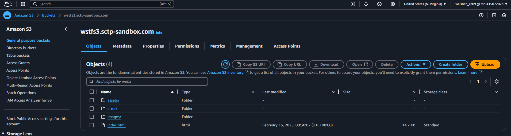

# 2. Disable Block all public acess & upload object policy
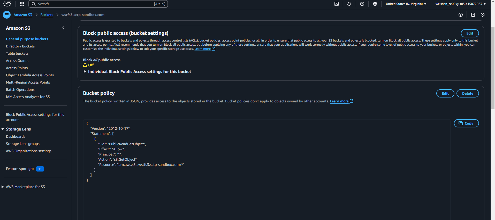

# 3. Clone object to S3 Bucket
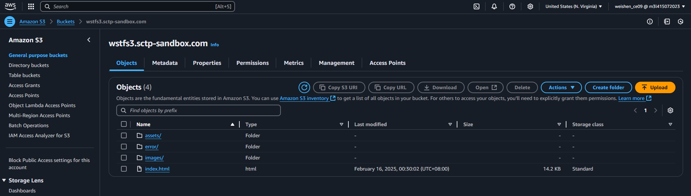

# 4. Website Configuration
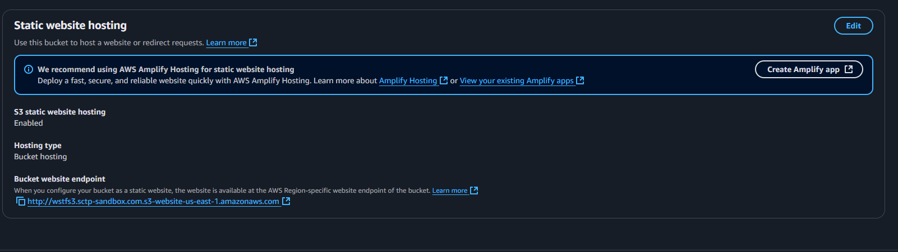

# 5. Domain in Hozted Zone
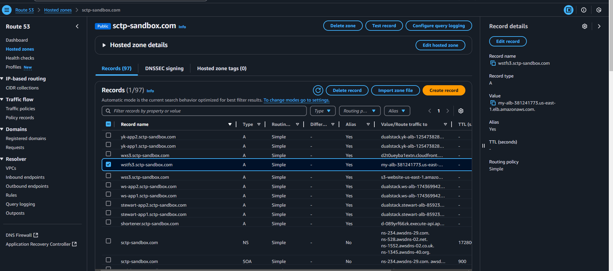

# 6. SSL/TSL Certificates for Domain
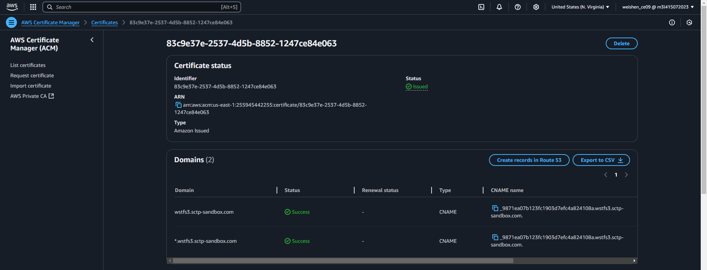

# 7. Load Balancer with HTTPS listening rules
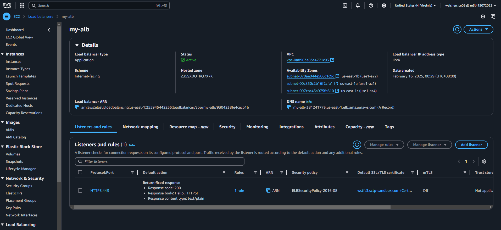

# 8. Certificates attached to HTTP Listener
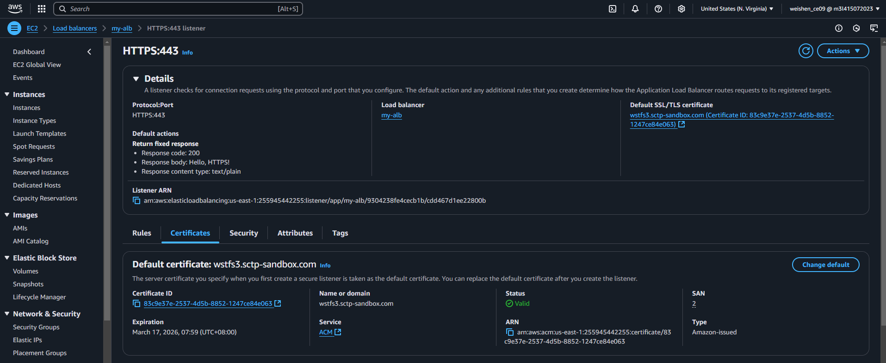

# 9. Assessing Statis Website via Load Balancer using DNS name
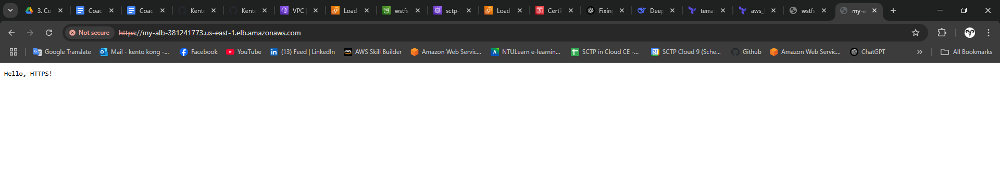
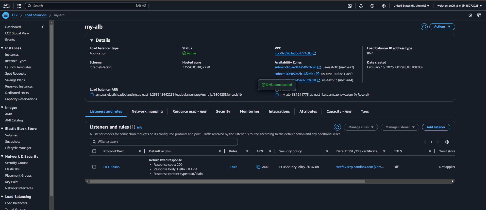
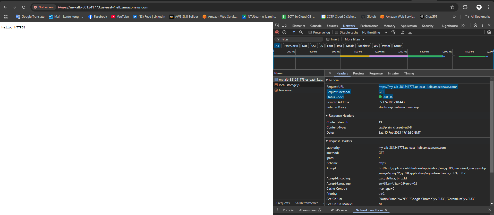

# ** VPC 
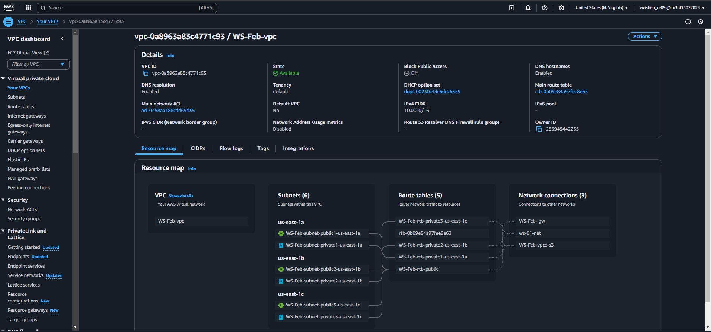

